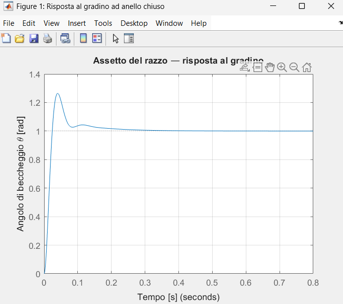
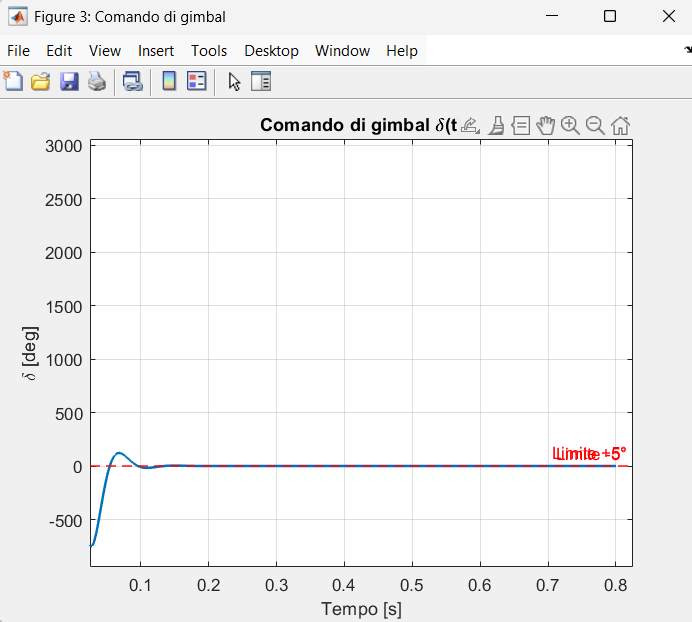
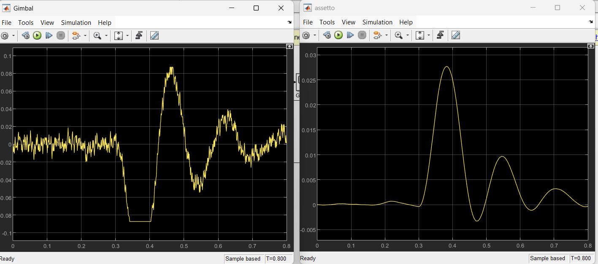
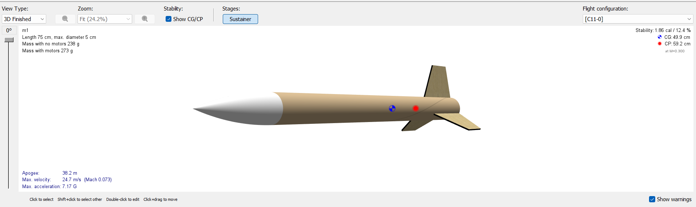
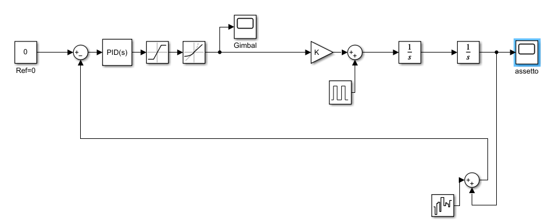

# Rocket TVC Attitude Control

Design and simulation of a Thrust Vector Control (TVC) attitude stabilization system for a solid-propellant model rocket. Rocket dynamics parameters are derived from an OpenRocket flight simulation and used to design a PID controller in MATLAB, with full closed-loop validation in Simulink including actuator constraints, IMU noise and wind gust disturbance rejection.

## Pipeline

## Rocket parameters

Derived from OpenRocket simulation of the airframe with an Estes C11-0 motor.

| Parameter | Value |
|---|---|
| Motor | Estes C11-0 |
| Burn time | 0.8 s |
| Total mass | 0.27 kg |
| Longitudinal moment of inertia | 0.014 kg·m² |
| CG-to-gimbal distance | 0.255 m |
| Plant gain K = T·L/I | 200 rad/s² per rad of gimbal |

The pitch-axis dynamics reduce to a double integrator with gain K, controlled by gimbal deflection δ: θ̈ = K · δ

## Controller

- **PID with filtered derivative**: Kp = 2.5, Ki = 0, Kd = 0.12, Tf = 0.05
- **Actuator model**: ±5° saturation + 500°/s slew rate limit
- **Sensor model**: MEMS-grade IMU noise (σ ≈ 0.06°)
- **Disturbance**: wind gust modeled as a pulse of angular acceleration

## Results

### Open-loop analysis (MATLAB)

Step response and stability margins of the linear closed-loop system:

Phase margin ≈ 83°, gain margin infinite.

### Closed-loop simulation (Simulink)

Full nonlinear simulation with actuator saturation, rate limiting, IMU noise and a wind gust disturbance at t = 0.3 s:

- Peak attitude deviation under wind gust: **1.6°**
- Settling time after disturbance: **< 300 ms**
- No actuator limit-cycling under nominal noise conditions

### Rocket and control system

## Design iterations

Controller tuning required an iterative trade-off between response speed and noise sensitivity. Initial high-gain settings exhibited actuator limit-cycling caused by derivative amplification of IMU noise interacting with the servo rate limit. Gains were retuned (Kd reduced, derivative filter time constant increased) to eliminate the limit cycle while preserving phase margin and disturbance rejection.

## Repository structure

## Tools

MATLAB R2024b · Simulink · Control System Toolbox · OpenRocket 

## Author

Francesco Pighetti — Aerospace Engineering student, Politecnico di Torino
